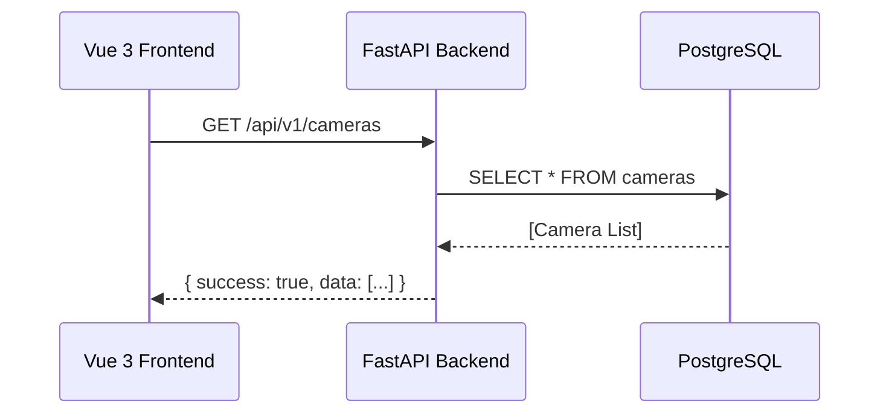
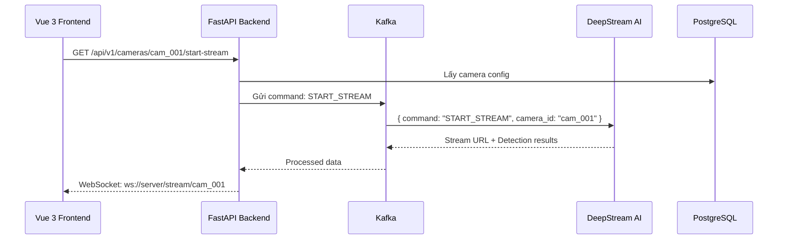
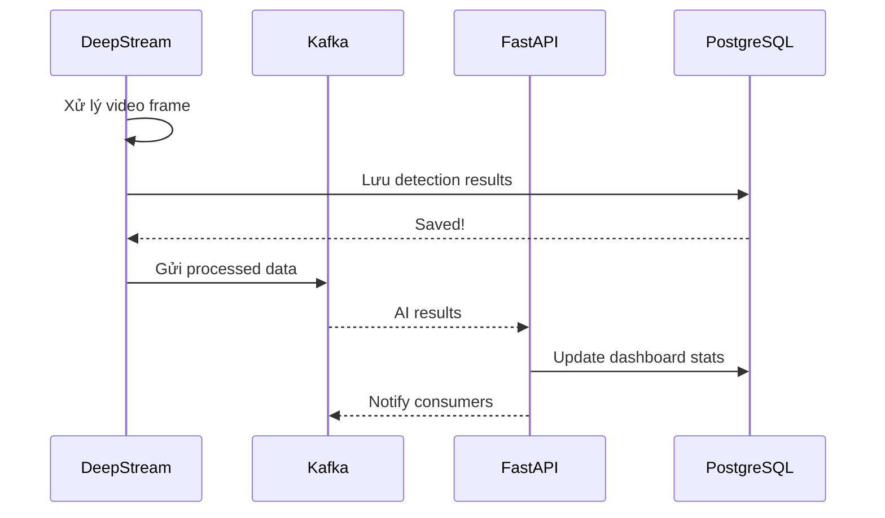
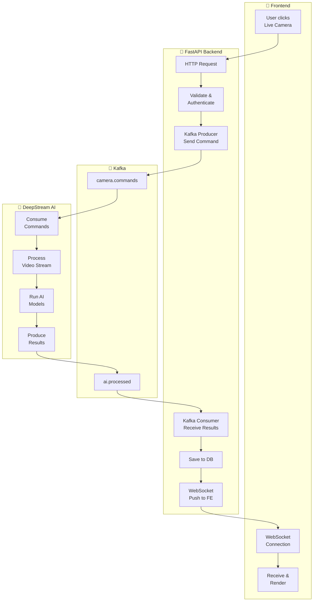

# System Architecture Flow - FE → BE → Kafka → AI

## Tổng quan Kiến trúc với Kafka

```mermaid
flowchart TB
    subgraph Frontend["🎨 Vue 3 Frontend"]
        FE["Web Browser<br/>Client"]
    end

    subgraph Backend["🐍 Python FastAPI"]
        API["FastAPI Server<br/>REST API"]
        WS["WebSocket Server<br/>Real-time"]
        KAFKA_P["Kafka Producer<br/>Gửi command"]
        KAFKA_C["Kafka Consumer<br/>Nhận results"]
    end

    subgraph Kafka["🔄 Apache Kafka"]
        K_CMD["topic: camera.commands<br/>Lệnh điều khiển"]
        K_AI["topic: ai.processed<br/>Kết quả AI"]
        K_RAW["topic: camera.raw<br/>Video metadata"]
    end

    subgraph DeepStream["🤖 AI Processing"]
        DS["DeepStream<br/>Pipeline"]
        DS_SUB["Kafka Consumer<br/>Nhận command"]
        DS_PROD["Kafka Producer<br/>Gửi kết quả"]
    end

    subgraph Database["💾 PostgreSQL"]
        DB[( "Database" )]
    end

    %% Flows
    FE <-->|"HTTP/WS"| API
    API <-->|"Read/Write"| DB
    API <-->|"Send Command"| KAFKA_P
    KAFKA_C <-->|"Consume Results"| K_AI
    KAFKA_P --> K_CMD
    K_AI --> KAFKA_C
    K_CMD --> DS_SUB
    DS_PROD --> K_AI
    DS --> DB
```

---

## Chi tiết từng thành phần

### 1. 🎨 Frontend (Vue 3)

Frontend giao tiếp với Backend qua **2 cách**:

| Loại | Sử dụng cho | Ví dụ |
|------|-------------|--------|
| **HTTP REST** | Thao tác CRUD | Đăng nhập, lấy danh sách camera, cấu hình |
| **WebSocket** | Real-time | Live stream, thông báo real-time |

```javascript
// Vue 3 - Gọi API
import axios from 'axios'

// REST API
const cameras = await axios.get('/api/v1/cameras')
const staffStats = await axios.get('/api/v1/staff/performance?date=2024-01-15')

// WebSocket cho real-time
const ws = new WebSocket('ws://localhost:8000/ws/dashboard')
ws.onmessage = (event) => {
  const data = JSON.parse(event.data)
  // Cập nhật UI real-time
}
```

### 2. 🐍 Backend (FastAPI)

Backend đóng vai trò **trung gian** giữa Frontend và AI:

```python
# backend/main.py (ví dụ)
from fastapi import FastAPI, WebSocket
from kafka import KafkaProducer, KafkaConsumer
import json

app = FastAPI()

# Kafka Producer - Gửi command xuống AI
producer = KafkaProducer(
    bootstrap_servers='localhost:9092',
    value_serializer=lambda v: json.dumps(v).encode('utf-8')
)

# Kafka Consumer - Nhận kết quả từ AI
consumer = KafkaConsumer(
    'ai.processed',
    bootstrap_servers='localhost:9092',
    value_deserializer=lambda m: json.loads(m.decode('utf-8'))
)

# ========================
# REST API Endpoints
# ========================

@app.get("/api/v1/cameras")
async def get_cameras():
    """Lấy danh sách camera từ DB"""
    return db.cameras.find_all()

@app.get("/api/v1/dashboard/stats")
async def get_dashboard_stats():
    """Lấy thống kê dashboard từ DB"""
    return db.get_daily_stats()

# ========================
# WebSocket - Real-time
# ========================

@app.websocket("/ws/dashboard")
async def websocket_endpoint(websocket: WebSocket):
    await websocket.accept()
    while True:
        # Gửi data real-time cho FE
        stats = db.get_realtime_stats()
        await websocket.send_json(stats)
```

---

## 📡 Luồng dữ liệu chi tiết

### Luồng 1: FE yêu cầu lấy danh sách Camera



**Response:**
```json
{
  "success": true,
  "data": [
    {
      "id": "cam_001",
      "name": "Camera Quầy",
      "rtsp_url": "rtsp://192.168.1.100:554/stream1",
      "is_active": true
    }
  ]
}
```

---

### Luồng 2: FE yêu cầu xem Live Stream



**Kafka Message - Command (FE → AI):**
```json
{
  "command_id": "cmd_001",
  "command": "START_STREAM",
  "camera_id": "cam_001",
  "timestamp": "2024-01-15T10:00:00Z",
  "options": {
    "overlay_enabled": true,
    "detections": ["person", "face", "food"]
  }
}
```

**Kafka Message - Result (AI → BE):**
```json
{
  "command_id": "cmd_001",
  "camera_id": "cam_001",
  "timestamp": "2024-01-15T10:00:01Z",
  "detections": [
    {
      "type": "person",
      "track_id": 1,
      "bounding_box": [100, 100, 200, 300],
      "action": "cooking",
      "staff_id": "staff_001",
      "confidence": 0.92
    }
  ]
}
```

---

### Luồng 3: AI xử lý và lưu vào DB



---

## 🎯 Các Kafka Topics cần thiết

```python
# Tất cả topics trong hệ thống
TOPICS = {
    # Command topics - Frontend gửi xuống AI
    "camera.commands": "Lệnh điều khiển camera",
    "ai.config": "Cấu hình AI cho từng camera",

    # Result topics - AI gửi lên
    "ai.face.detections": "Phát hiện khuôn mặt",
    "ai.action.detections": "Phát hiện hành động",
    "ai.food.detections": "Phát hiện món ăn",
    "ai.customer.detections": "Phát hiện khách hàng",

    # Aggregated
    "ai.processed": "Kết quả tổng hợp (cho dashboard)",

    # Raw
    "camera.raw": "Video metadata thô"
}
```

### Chi tiết từng Topic:

```python
# ========================
# 1. CAMERA.COMMANDS
# ========================
# FE -> AI: Gửi lệnh điều khiển

{
    "message_id": "msg_001",
    "command": "START_STREAM",  # START_STREAM, STOP_STREAM, RESTART
    "camera_id": "cam_001",
    "timestamp": "2024-01-15T10:00:00Z",
    "payload": {
        "ai_enabled": {
            "face_recognition": True,
            "har": True,
            "food_qc": False,
            "customer_flow": True
        },
        "fps": 30,
        "overlay": True
    }
}

# ========================
# 2. AI.FACE.DETECTIONS
# ========================
# AI -> BE: Phát hiện khuôn mặt

{
    "timestamp": "2024-01-15T10:00:01Z",
    "camera_id": "cam_001",
    "detections": [
        {
            "face_id": "face_abc123",
            "bounding_box": {"x": 450, "y": 120, "w": 80, "h": 100},
            "embedding": [0.123, -0.456, ...],  # 512 dims
            "staff_id": "staff_001",  # Null nếu không nhận diện
            "confidence": 0.95,
            "liveness": True,
            "quality": 0.88
        }
    ]
}

# ========================
# 3. AI.ACTION.DETECTIONS
# ========================
# AI -> BE: Phát hiện hành động

{
    "timestamp": "2024-01-15T10:00:01Z",
    "camera_id": "cam_001",
    "actions": [
        {
            "track_id": "person_001",
            "staff_id": "staff_001",
            "action_type": "cooking",
            "action_label": "chopping",
            "confidence": 0.92,
            "duration_seconds": 180,
            "is_productive": True,
            "pose_keypoints": {...}
        }
    ]
}

# ========================
# 4. AI.FOOD.DETECTIONS
# ========================
# AI -> BE: Phát hiện món ăn

{
    "timestamp": "2024-01-15T10:00:01Z",
    "camera_id": "cam_kitchen",
    "detections": [
        {
            "food_id": "food_001",
            "bounding_box": {"x": 300, "y": 400, "w": 200, "h": 150},
            "matched_with": "master_pho_001",
            "similarity_score": 0.87,
            "result": "warning",  # pass, fail, warning
            "details": {
                "color_match": True,
                "portion_match": True,
                "topping_present": False
            },
            "staff_id": "staff_003"
        }
    ]
}

# ========================
# 5. AI.CUSTOMER.DETECTIONS
# ========================
# AI -> BE: Phát hiện khách hàng

{
    "timestamp": "2024-01-15T10:00:01Z",
    "camera_id": "cam_entrance",
    "events": [
        {
            "session_id": "cust_session_xyz",
            "event_type": "entry",
            "zone": "entrance",
            "body_embedding": [0.111, -0.222, ...],  # 512 dims for Re-ID
            "clothing_color": "dark_blue",
            "is_staff": False,
            "dwell_time_seconds": null
        }
    ]
}

# ========================
# 6. AI.PROCESSED (Tổng hợp - cho Dashboard)
# ========================
# AI -> BE: Dữ liệu tổng hợp cho real-time dashboard

{
    "timestamp": "2024-01-15T10:00:05Z",  # Mỗi 5 giây
    "camera_id": "cam_001",
    "summary": {
        "staff_count": 5,
        "active_staff": 4,
        "idle_count": 1,
        "actions": {
            "cooking": 3,
            "washing": 1,
            "idle": 1
        }
    }
}
```

---

## 🔄 Complete Flow - Từ FE đến AI và ngược lại



---

## 📋 Tóm tắt các thành phần cần lưu

### Trong Database:

| Table | Dữ liệu lưu | Nguồn |
|-------|-------------|-------|
| `cameras` | Thông tin camera, RTSP URL | User nhập |
| `staff` | Thông tin nhân viên | User nhập |
| `staff_faces` | Face embeddings | AI phát hiện |
| `staff_actions` | Hành động nhân viên | AI phát hiện |
| `food_qc_results` | Kết quả QC món ăn | AI phát hiện |
| `customer_events` | Sự kiện khách hàng | AI phát hiện |
| `daily_reports` | Báo cáo tổng hợp | Tính từ events |

### Trong Kafka:

| Topic | Direction | Nội dung |
|-------|-----------|----------|
| `camera.commands` | FE → AI | Lệnh điều khiển |
| `ai.face.detections` | AI → BE | Phát hiện khuôn mặt |
| `ai.action.detections` | AI → BE | Phát hiện hành động |
| `ai.food.detections` | AI → BE | Phát hiện món ăn |
| `ai.customer.detections` | AI → BE | Phát hiện khách |
| `ai.processed` | AI → BE | Tổng hợp real-time |

---

Bạn thấy rõ hơn chưa? Cần mình giải thích thêm phần nào hoặc vẽ diagram chi tiết hơn không?
