# Camera Analyst - ERD (Entity Relationship Diagram)

> Sử dụng: Copy file này vào VS Code có extension Mermaid Preview để xem đồ họa

```mermaid
erDiagram
    %% ============================================
    %% 1. TENANT MANAGEMENT
    %% ============================================

    COMPANIES {
        uuid id PK
        string name
        string code UK
        text address
        string phone
        string logo_url
        jsonb settings
        boolean is_active
        timestamp created_at
        timestamp updated_at
    }

    BRANCHES {
        uuid id PK
        uuid company_id FK
        string name
        string code
        text address
        string timezone
        jsonb settings
        boolean is_active
        timestamp created_at
        timestamp updated_at
    }

    USERS {
        uuid id PK
        uuid branch_id FK
        string email UK
        string password_hash
        string full_name
        string phone
        string avatar_url
        string role
        boolean is_active
        timestamp last_login
        timestamp created_at
        timestamp updated_at
    }

    PERMISSIONS {
        uuid id PK
        uuid user_id FK
        string resource
        text[] actions
        timestamp created_at
    }

    %% Relationships - Tenant
    COMPANIES ||--o{ BRANCHES : "owns"
    BRANCHES ||--o{ USERS : "has"
    USERS ||--o{ PERMISSIONS : "has"

    %% ============================================
    %% 2. STAFF MANAGEMENT
    %% ============================================

    STAFF {
        uuid id PK
        uuid branch_id FK
        string employee_code
        string full_name
        string phone
        string email
        string department
        string position
        date hire_date
        decimal salary_per_hour
        boolean is_active
        timestamp created_at
        timestamp updated_at
    }

    STAFF_FACES {
        uuid id PK
        uuid staff_id FK
        vector(512) embedding
        string image_url
        decimal quality_score
        boolean is_primary
        timestamp created_at
    }

    SHIFTS {
        uuid id PK
        uuid branch_id FK
        string name
        time start_time
        time end_time
        boolean is_night_shift
        timestamp created_at
    }

    SHIFT_SCHEDULES {
        uuid id PK
        uuid staff_id FK
        uuid shift_id FK
        date work_date
        string status
        timestamp created_at
    }

    %% Relationships - Staff
    BRANCHES ||--o{ STAFF : "has"
    STAFF ||--o{ STAFF_FACES : "has"
    BRANCHES ||--o{ SHIFTS : "has"
    STAFF ||--o{ SHIFT_SCHEDULES : "assigned"
    SHIFTS ||--o{ SHIFT_SCHEDULES : "contains"

    %% ============================================
    %% 3. CAMERA & CONFIG
    %% ============================================

    CAMERAS {
        uuid id PK
        uuid branch_id FK
        string name
        string code
        text rtsp_url
        string location
        string stream_type
        string resolution
        integer fps
        jsonb ai_enabled
        boolean is_active
        timestamp last_online
        timestamp created_at
        timestamp updated_at
    }

    CAMERA_AI_CONFIGS {
        uuid id PK
        uuid camera_id FK
        boolean face_recognition_enabled
        decimal face_similarity_threshold
        boolean liveness_detection_enabled
        boolean har_enabled
        integer idle_threshold_minutes
        text[] actions_to_detect
        boolean food_qc_enabled
        decimal food_similarity_threshold
        string trigger_method
        boolean customer_flow_enabled
        boolean staff_exclusion_enabled
        integer min_dwell_time_seconds
        timestamp created_at
        timestamp updated_at
    }

    %% Relationships - Camera
    BRANCHES ||--o{ CAMERAS : "has"
    CAMERAS ||--o| CAMERA_AI_CONFIGS : "configured"

    %% ============================================
    %% 4. ATTENDANCE
    %% ============================================

    ATTENDANCE_RECORDS {
        uuid id PK
        uuid staff_id FK
        uuid camera_id FK
        string event_type
        timestamp timestamp
        uuid embedding_id FK
        decimal confidence_score
        string image_url
        boolean is_auto_generated
        timestamp created_at
    }

    DAILY_ATTENDANCE {
        uuid id PK
        uuid staff_id FK
        uuid shift_id FK
        date work_date
        time check_in_time
        time check_out_time
        decimal check_in_confidence
        decimal check_out_confidence
        decimal total_hours
        string status
        timestamp created_at
        timestamp updated_at
    }

    %% Relationships - Attendance
    STAFF ||--o{ ATTENDANCE_RECORDS : "has"
    CAMERAS ||--o{ ATTENDANCE_RECORDS : "records"
    STAFF_FACES ||--o{ ATTENDANCE_RECORDS : "matches"
    STAFF ||--o{ DAILY_ATTENDANCE : "has"
    SHIFTS ||--o{ DAILY_ATTENDANCE : "in"

    %% ============================================
    %% 5. HUMAN ACTION RECOGNITION
    %% ============================================

    STAFF_ACTIONS {
        uuid id PK
        uuid staff_id FK
        uuid camera_id FK
        string action_type
        string action_label
        decimal confidence_score
        timestamp started_at
        timestamp ended_at
        integer duration_seconds
        boolean is_productive
        string proof_image_url
        jsonb metadata
        timestamp created_at
    }

    DAILY_STAFF_PERFORMANCE {
        uuid id PK
        uuid staff_id FK
        date work_date
        integer cooking_seconds
        integer washing_seconds
        integer cleaning_seconds
        integer idle_seconds
        integer phone_usage_seconds
        integer standing_seconds
        integer sitting_seconds
        integer other_seconds
        integer total_work_seconds
        integer total_idle_seconds
        decimal productivity_rate
        timestamp created_at
        timestamp updated_at
    }

    %% Relationships - Actions
    STAFF ||--o{ STAFF_ACTIONS : "performs"
    CAMERAS ||--o{ STAFF_ACTIONS : "captures"
    STAFF ||--o{ DAILY_STAFF_PERFORMANCE : "has"

    %% ============================================
    %% 6. FOOD QUALITY CONTROL
    %% ============================================

    FOOD_ITEMS {
        uuid id PK
        uuid branch_id FK
        string name
        string code
        string category
        decimal price
        boolean is_active
        timestamp created_at
        timestamp updated_at
    }

    FOOD_MASTER_IMAGES {
        uuid id PK
        uuid food_item_id FK
        string image_url
        vector(512) embedding
        uuid captured_by FK
        text notes
        boolean is_active
        timestamp created_at
    }

    FOOD_QC_RESULTS {
        uuid id PK
        uuid camera_id FK
        uuid food_item_id FK
        string result_status
        decimal similarity_score
        boolean color_match
        boolean portion_match
        boolean topping_present
        string proof_image_url
        uuid master_image_id FK
        uuid staff_id FK
        string checked_by
        timestamp checked_at
        timestamp created_at
    }

    DAILY_FOOD_QC {
        uuid id PK
        uuid branch_id FK
        uuid food_item_id FK
        date work_date
        integer total_checks
        integer pass_count
        integer fail_count
        integer warning_count
        decimal pass_rate
        decimal estimated_loss
        timestamp created_at
    }

    %% Relationships - Food QC
    BRANCHES ||--o{ FOOD_ITEMS : "serves"
    FOOD_ITEMS ||--o{ FOOD_MASTER_IMAGES : "has"
    FOOD_ITEMS ||--o{ FOOD_QC_RESULTS : "checked"
    FOOD_MASTER_IMAGES ||--o{ FOOD_QC_RESULTS : "referenced"
    CAMERAS ||--o{ FOOD_QC_RESULTS : "monitors"
    STAFF ||--o{ FOOD_QC_RESULTS : "prepared_by"
    BRANCHES ||--o{ DAILY_FOOD_QC : "tracks"

    %% ============================================
    %% 7. CUSTOMER ANALYTICS
    %% ============================================

    CUSTOMER_EVENTS {
        uuid id PK
        uuid branch_id FK
        uuid camera_id FK
        string event_type
        string session_id
        string zone
        timestamp detected_at
        integer dwell_time_seconds
        vector(512) body_embedding
        string clothing_color
        boolean is_staff
        jsonb metadata
        timestamp created_at
    }

    HOURLY_CUSTOMER_STATS {
        uuid id PK
        uuid branch_id FK
        uuid camera_id FK
        date stat_date
        integer stat_hour
        integer entry_count
        integer exit_count
        integer peak_concurrent
        integer avg_dwell_time_seconds
    }

    DAILY_CUSTOMER_STATS {
        uuid id PK
        uuid branch_id FK
        date stat_date
        integer total_entry
        integer total_exit
        integer peak_concurrent
        integer avg_dwell_time_seconds
        jsonb hourly_distribution
        timestamp created_at
    }

    %% Relationships - Customer
    BRANCHES ||--o{ CUSTOMER_EVENTS : "tracks"
    CAMERAS ||--o{ CUSTOMER_EVENTS : "detects"
    BRANCHES ||--o{ HOURLY_CUSTOMER_STATS : "aggregates"
    CAMERAS ||--o{ HOURLY_CUSTOMER_STATS : "aggregates"
    BRANCHES ||--o{ DAILY_CUSTOMER_STATS : "aggregates"

    %% ============================================
    %% 8. REPORTS & NOTIFICATIONS
    %% ============================================

    DAILY_REPORTS {
        uuid id PK
        uuid branch_id FK
        date report_date
        integer total_staff
        decimal total_work_hours
        decimal total_idle_hours
        decimal labor_efficiency
        decimal theoretical_labor_cost
        decimal actual_labor_cost
        decimal savings_amount
        decimal food_qc_pass_rate
        integer failed_dish_count
        decimal estimated_food_loss
        integer total_customers
        string peak_hour
        integer avg_service_time_minutes
        timestamp generated_at
        string generated_by
    }

    NOTIFICATIONS {
        uuid id PK
        uuid branch_id FK
        string type
        string title
        string message
        string priority
        string reference_type
        uuid reference_id
        boolean is_read
        timestamp read_at
        timestamp created_at
    }

    NOTIFICATION_SETTINGS {
        uuid id PK
        uuid branch_id FK
        string notify_type
        text[] channels
        boolean is_enabled
        jsonb threshold
    }

    %% Relationships - Reports
    BRANCHES ||--o{ DAILY_REPORTS : "generates"
    BRANCHES ||--o{ NOTIFICATIONS : "sends"
    BRANCHES ||--o{ NOTIFICATION_SETTINGS : "configures"

    %% ============================================
    %% 9. AUDIT LOGS
    %% ============================================

    AUDIT_LOGS {
        uuid id PK
        uuid user_id FK
        uuid branch_id FK
        string action
        string entity_type
        uuid entity_id
        jsonb old_values
        jsonb new_values
        inet ip_address
        text user_agent
        timestamp created_at
    }

    %% Relationships - Audit
    USERS ||--o{ AUDIT_LOGS : "performs"
    BRANCHES ||--o{ AUDIT_LOGS : "logs"
```



---

## 📋 Legend

| Ký hiệu | Ý nghĩa |
|---------|---------|
| `PK` | Primary Key |
| `FK` | Foreign Key |
| `UK` | Unique |
| `vector(512)` | Face/Body Embedding (512 dimensions) |
| `jsonb` | JSON Binary (NoSQL-like) |
| `decimal` | Decimal number |
| `time` | Time of day |
| `timestamp` | Date + Time |
| `date` | Date only |

---

## 🔍 Key Relationships

```
Company (1) ─────< Branch (N) ─────< All Other Entities
                           │
                           ├── Staff ─────< Staff_Faces
                           │                < Attendance_Records
                           │                < Staff_Actions
                           │
                           ├── Cameras ─────< Camera_AI_Configs
                           │
                           ├── Food_Items ─────< Food_Master_Images
                           │                      < Food_QC_Results
                           │
                           ├── Customer_Events
                           │      < Hourly_Customer_Stats
                           │      < Daily_Customer_Stats
                           │
                           ├── Daily_Reports
                           └── Notifications
```
